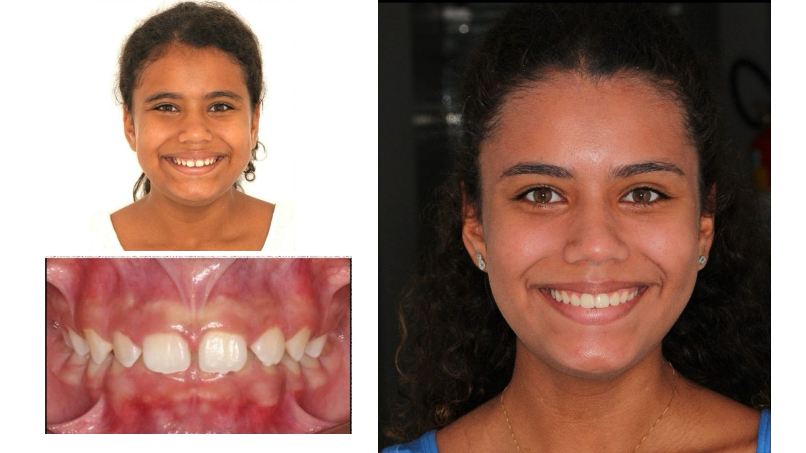

# Landing Page Dr. Joaquim - Imagem Única ✅

## 🎯 VERSÃO SIMPLIFICADA - 1 imagem por caso

### O que mudou:

**ANTES** ❌
```
Estrutura complexa:
- 3 arquivos por caso (antes-front, antes-intra, depois)
- Difícil gerenciar
- Complicado substituir
```

**AGORA** ✅
```
Estrutura SIMPLES:
- 1 arquivo por caso (antes + depois combinados)
- Fácil gerenciar  
- Substituição rápida
```

---

## 📐 FORMATO DAS IMAGENS:

### **Tamanho obrigatório:** 1920 × 1080 pixels (16:9)

**Por que esse formato?**
- ✅ Funciona perfeito em mobile E desktop
- ✅ Padrão universal (Full HD)
- ✅ Não distorce em nenhuma tela
- ✅ Layout horizontal ideal para antes/depois

---

## 📁 ESTRUTURA DE ARQUIVOS:

```
drjoaquim-imagem-unica/
├── index.html
└── assets/
    └── cases/
        ├── caso-01.jpg ✅ (SUA IMAGEM já está aqui)
        ├── caso-02.jpg ⏳ (SUBSTITUA com sua imagem)
        ├── caso-03.jpg ⏳ (SUBSTITUA com sua imagem)
        ├── caso-04.jpg ⏳ (SUBSTITUA com sua imagem)
        ├── caso-05.jpg ⏳ (SUBSTITUA com sua imagem)
        ├── caso-06.jpg ⏳ (SUBSTITUA com sua imagem)
        └── caso-07.jpg ⏳ (SUBSTITUA com sua imagem)
```

---

## 🎨 COMO CRIAR SUAS IMAGENS:

### Modelo da sua imagem (caso-01.jpg):
```
┌─────────────────────────────────────────┐
│                                         │
│  ANTES (2 fotos)  │  DEPOIS (1 foto)   │
│                   │                     │
│  [Rosto]          │  [Resultado]       │
│  [Intraoral]      │  (grande)          │
│                   │                     │
└─────────────────────────────────────────┘
       1920 × 1080 pixels (16:9)
```

### Passo a passo no Canva/Photoshop:

1. **Criar novo arquivo:**
   - Dimensões: 1920 × 1080 pixels
   - Fundo: branco ou preto (sua escolha)

2. **Layout recomendado:**
   - Esquerda (50%): 2 fotos "antes" empilhadas
   - Direita (50%): 1 foto grande "depois"

3. **Adicionar as fotos:**
   - Importe suas 3 fotos
   - Posicione conforme o modelo
   - Adicione textos "ANTES" e "DEPOIS" (opcional)

4. **Exportar:**
   - Formato: JPG (qualidade 85-90%)
   - Tamanho: 1920 × 1080 pixels
   - Nome: `caso-01.jpg`, `caso-02.jpg`, etc.

---

## 🔄 COMO SUBSTITUIR AS IMAGENS:

### Método 1 - Substituir arquivos:
```bash
1. Prepare suas 7 imagens (1920×1080px cada)
2. Renomeie para: caso-01.jpg, caso-02.jpg, ... caso-07.jpg
3. Substitua em: assets/cases/
4. Pronto!
```

### Método 2 - Usar nomes diferentes:
Se quiser usar nomes diferentes, edite o `index.html`:

Procure por:
```html

<div class="case-slide active" data-img="assets/cases/caso-01.jpg">
  <div class="case-frame case-frame-single">
    <figure class="case-hero case-hero-single">
      
    </figure>
  </div>
  <div class="case-caption">
    <span class="case-tag">Damon Ultima · 18 meses</span>         ← EDITE AQUI (técnica + tempo)
    <h3>Apinhamento severo — da infância à vida adulta</h3>       ← EDITE AQUI (título)
    <p>Tratamento iniciado cedo, com acompanhamento...</p>        ← EDITE AQUI (descrição)
  </div>
</div>
```

---

## ✅ CHECKLIST ANTES DO UPLOAD:

- [ ] Todas as 7 imagens têm 1920×1080px
- [ ] Todas nomeadas corretamente (caso-01.jpg a caso-07.jpg)
- [ ] Todas substituídas na pasta assets/cases/
- [ ] Textos editados no index.html (opcional)
- [ ] Testado localmente (abre o index.html no navegador)

---

## 🚀 FAZER UPLOAD NO GITHUB:

1. Faça upload de **TODA** a pasta `drjoaquim-imagem-unica`
2. Ative GitHub Pages (Settings → Pages)
3. Pronto! ✅

---

## 💡 DICAS IMPORTANTES:

### Qualidade das imagens:
- ✅ Use JPG com qualidade 85-90%
- ✅ Evite PNG pesado (arquivos grandes)
- ✅ Otimize antes do upload (máx 500KB por imagem)

### Layout da composição:
- ✅ Mantenha consistência entre todos os casos
- ✅ Use o mesmo fundo em todas
- ✅ Mesma fonte/estilo de texto (se usar)
- ✅ Espaçamento uniforme

### Ordem dos casos:
- ✅ Coloque os melhores casos primeiro (caso-01, caso-02)
- ✅ Varie os tipos de tratamento
- ✅ Mostre diferentes faixas etárias

---

## 📸 FERRAMENTAS RECOMENDADAS:

**Para criar as composições:**
- [Canva.com](https://canva.com) - Mais fácil (grátis)
- [Photopea.com](https://photopea.com) - Photoshop online (grátis)
- Photoshop - Profissional (pago)

**Para otimizar tamanho:**
- [Squoosh.app](https://squoosh.app) - Comprimir imagens
- [TinyPNG.com](https://tinypng.com) - Reduzir tamanho

---

**Versão simplificada - 1 imagem por caso - Super fácil de gerenciar!** 🎯🦷
